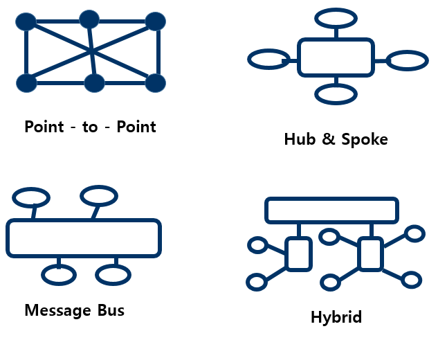
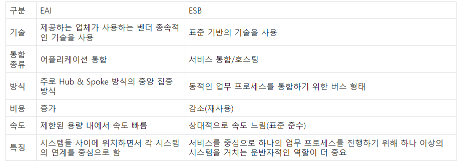

## 연계 모듈

#### 모듈이란?
> 소프트웨어나 하드웨어의 일부로, 큰 전체 시스템 및 체계 중 다른 구성 요소와 독립적인 하나의 구성 요소를 말한다.
> 예를 들어 개인용 컴퓨터 시스템은 각종 버스 기능을 탑재한 메인보드(마더보드)에 중앙처리장치(CPU), 주기억장치(RAM), 보조기억장치(HDD, SSD), 그래픽 카드, 전원공급장치 등을 조합함으로써 완성되는데, 이 구성요소 각각을 모듈이라 부르며, 각 모듈은 시스템의 특정한 기능을 담당한다. 예를 들어 그래픽 카드는 모니터 화면에 표시되는 영상을 만들어내는 모듈이다.
위의 예에서 각각의 모듈은 수많은 전자부품과 반도체 등으로 구성되어 있으며, 개중에는 자기 자신도 모듈러한 하위 구성요소(서브 모듈)의 조합으로 구성된 경우도 많다.

#### 모듈연계란?
> 내부 모듈과 외부 모듈 또는 내부 모듈 간 데이터 교환을 위해 관계를 설정하는 것

## 연계 모듈 기능 구현

## EAI 방식(Enterprise Application Integration)

- 기업 애플리케이션 통합
- 기업 내 필요한 여러 애플리케이션이 있을텐데, 이런 각종 애플리케이션 간 상호 연동이 가능하도록 통합하는 솔루션
- **구성요소**
  - EAI 플랫폼: 데이터 안전하게 전달하는 기능, 미들웨어 기능, 실행 환경 제공
  - 어댑터(Adapter): 애플리케이션을 연결하는 EAI의 핵심 장치 / 데이터 입출력 도구
  - 브로커(Broker):  시스템 간 데이터가 전송될 때 데이터 포맷, 코드를 변환
  - 메시지 큐(Message QUeue): 비동기 메시지를 사용하는 다른 응용 프로그램 사이에서 데이터를 송수신하는 기술
  - 비즈니스 워크플로우: 비즈니스 프로세스 자동화, 프로세스 감시 및 최적화

#### EAI 구축 유형

- Point-to-point
  - 가장 기초적인 애플리케이션 통합방법. 단순 1:1
  - 솔루션을 구매하지 않고 개발자 간 커뮤니케이션을 통해서도 통합 가능
- Hub & Spoke
  - 중앙 집중식 - 허브 장애시 전체 장애
- Message Bus
  - 애플리케이션 사이 미들웨어(버스)를 두어 연계
  - 확장성, 대용량 처리 good~
- Hybrid
  - 그룹 내: 허브앤스포크 / 그룹 간: 메시지 버스

## ESB 방식 (Enterprise Service Bus)

>  **ESB = SOA + EAI** 
>
>  SOA
>
> - 대규모 컴퓨터 시스템을 구축할 때의 개념으로 업무상에 일처리에 해당하는 소프트웨어 기능을 서비스로 판단하여 그 서비스를 네트워크상에 연동하여 시스템 전체를 구축해 나가는 방법론
>
> - 업무 처리 변화를 시스템에 빠르게 반영하고자 하기 위해 기업의 전반적인 정보 시스템을 서비스 단위로 구축해 다른 서비스와 연동 · 통합될 수 있도록 하는 시스템 구조
> - 기업의 IT 시스템을 비즈니스에 맞춰 유연하게 사용할 수 있다

- 기업에서 운영되는 여러 플랫폼이나 애플리케이션들을 하나의 시스템으로 관리할 수 있도록 **서비스 중심**의 통합을 지향하는 아키텍쳐
- 애플리케이션의 통합을 **느슨한 결합** 방식으로 지원

- 서비스들을 컴포넌트화된 논리적 집합으로 묶는 핵심 미들웨어
- 비즈니스 환경에 맞게 설계 및 전개 가능
- 버스 방식 => 확장성 good, 유연한 구성

#### EAI vs ESB

- EAI와 ESB는 미들웨어이면서 시스템의 연동이라는 동일한 목적을 수행하는 솔루션이지만 그 방법과 시스템 연계의 구현 방식에 대한 차이가 있다.
- 대표적인 차이: 중앙집중형 vs 버스 형태
- 중앙집중형인 eai의 단점을 극복하기 위해(유연하지 않음, 단일 장애점에 취약), 그리고 soa의 등장으로 esb를 밀기 시작한 것.
- 근데 사실 경계가 모호

## 웹 서비스 방식

- 네트워크에 분산된 정보를 서비스 형태로 개방하여 표준화된 방식으로 공유하는 기술.
- soa를 실현하는 대표적인 기술

#### 웹서비스 방식 유형

1. SOAP(Simple Object Access Protocol)
   - HTTP, HTTPS, SMTP 등을 써서 XML 기반의 메시지를 네트워크 상태에서 교환하는 프로토콜
   - 보통 원격 프로시저 호출(RPC)을 하는 메시지 패턴을 사용
2.  WSDL(Web Service Description Language)
   - 웹 서비스명, 제공 위치, 메시지 포맷, 프로토콜 등 정보 웹 서비스에 대한 상세 정보가 xml 형식으로 구현되어 있는 언어

3. UDDI(Universal Description, Discovery and Integration)
   - 웹 서비스에 대한 정보인 WSDL을 등록하고 검색하기 위한 **저장소**
   - 공개적으로 접근 검색이 가능한 레지스트리이자 표준

## IPC 방식 (Inter-Process Communication)

- 운영체제에서 프로세스 간 서로 데이터를 주고받기 위한 통신 기술

#### 주요 기술

- 메시지 큐: 메시지 또는 패킷단위로 동작하여 프로세스 간 통신
- 공유메모리: 한 프로세스의 일부분을 다른 프로세스와 공유
- 소켓: 클라이언트와 서버 프로세스 둘 사이 통신
- 세마포어: 프로세스 사이의 동기를 맞추는 기능

## Quiz

1. 다음은 무엇일까요?

   HTTP, HTTPS, SMTP를 통해서 XML 기반의 데이터를 주고받는 프로토콜

2. EAI 유형에는 메시지버스, 하이브리드, (           ), (              ) 네 가지가 있다.

3. 웹 서비스명, 제공 위치, 메시지 포맷, 프로토콜 정보 등 웹 서비스에 대한 상세 정보가 기술된 XML 형식으로 구성된 언어는 무엇일까요? 