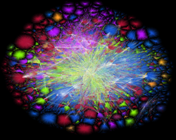
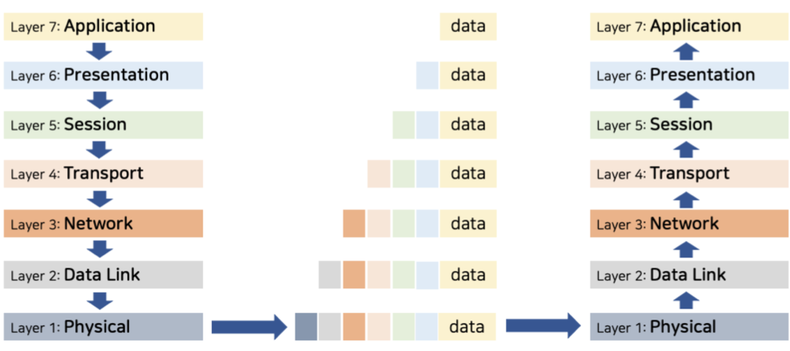
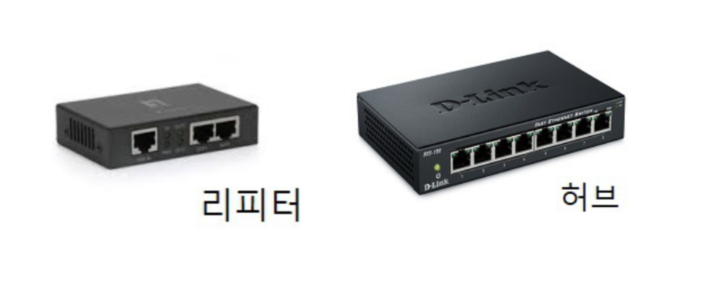
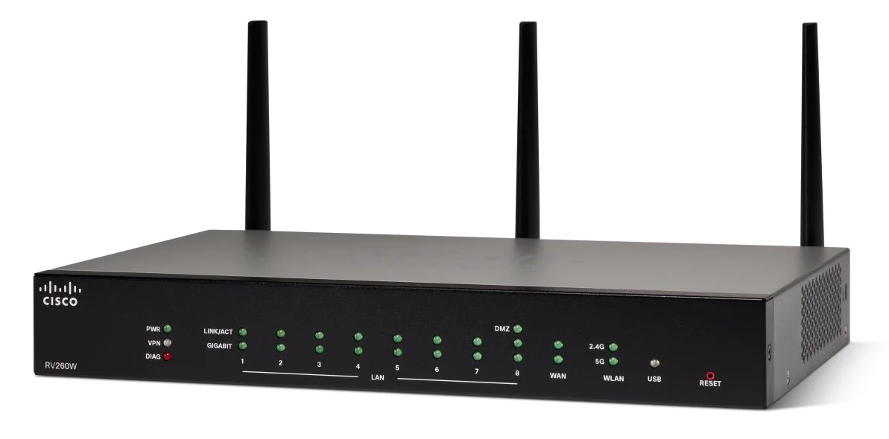

## 네트워크 계층 구조 파악

### 네트워크란?

> - 원하는 정보를 수신자 또는 기기에 정확하게 전송하기 위한 기반 인프라
>
> - 거미줄같이 꼬인 회선을 뜻한다.
>
> - 전자신호를 통해 통신하는 모든 기기가 서로 통신하기 위해 만든 하나의 망

###  OSI(Open System Interconnection) 7계층

> 국제표준화기구(ISO)에서 개발한 컴퓨터 네트워크 프로토콜 디자인과 통신을 계층으로 나누어 설명한 것
>
> - 각 계층은 서로 독립적
> - 각 계층은 하위 계층의 기능을 이용하여 상위 계층에 기능을 제공
> - 계층을 지날 때마다 헤더(해당 계층의 기능과 관련된 제어 정보)가 붙는다.
>   * 헤더란? 데이터 앞부분에 파일에 대한 정보를 실어놓은 부분. 주로 데이터 형식에 대한 정보나 시간, 주소 데이터로 구성되어 있다.
> - 제어 정보들은 계층을 지날 때마다 보낼 땐 추가, 받을 땐 제거된다.

#### 1. 물리계층(Physical Layer)

- 0과 1의 비트 정보를 회선에 보내기 위한 전기적 신호 변환
- 프로토콜:  RS-232C
- 전송단위: 비트(Bit)
- 장비: 허브, 리피터

#### 2. 데이터링크 계층(Data Link Layer)

- 인접 시스템 간 데이터 전송, 전송 오류 제어 / 동기화, 오류 제어, 흐름 제어, 회선 제어
- 프로토콜: HDLC, PPP
- 전송단위: 프레임(Frame)
- 장비: 브리지, 스위치

#### 3. 네트워크 계층(Network Layer)

- 단말기 간 데이터 전송을 위한 최적화된 경로 제공
- 프로토콜: IP, ICMP
- 전송단위: 패킷(Packet)
- 장비: 라우터

#### 4. 전송 계층(Transport Layer)

- 송수신 프로세스 간의 연결 / 신뢰성 있는 통신 보장 / 데이터 분할, 재조립, 흐름 제어, 오류 제어, 혼잡 제어
- 프로토콜: TCP, UDT
- 전송단위: 세그먼트(Segment)
- 장비: L4 스위치

#### 5. 세션 계층(Session Layer)

- 송수신 간 논리적인 연결 / 연결 접속, 동기제어
- 프로토콜: RPC, NetBIOS
- 전송단위: 데이터(Data)
- 장비: 호스트(PC 등)

#### 6. 표현 계층(Presentation Layer)

- 데이터 형식 설정, 부호교환, 암/복호화
- 프로토콜: JPEG, MPEG

#### 7. 응용 계층(Application Layer)

- 사용자와 네트워크 간 응용서비스 연결, 데이터 생성
- 프로토콜: HTTP, FTP

### 네트워크 장비

#### 1계층 장비

- 허브

  여러 대의 컴퓨터를 연결하여 네트워크로 보내거나, 하나의 네트워크로 수신된 정보를 여러 대의 컴퓨터로 송신하기 위한 장비

- 리피터

  디지털 신호를 증폭시켜 주는 역할을 하여 신호가 약해지지 않고 컴퓨터로 수신되도록 하는 장비

#### 2계층 장비

- 브리지

  두 개의 근거리통신망(LAN)을 서로 연결해 주는 통신망 연결 장치

  허브보다 한등급 위 장비이다.

-  L2 스위치

  

  브리지와 허브는 전송속도가 느림 -> 개선을 위해 출발지에서 들어온 프레임을 목적지 MAC 주소 기반으로 빠르게 전송시키는 통신 장치

  종류에 따라 세 가지 방식 중 하나 사용

  - Store and Forwarding: 데이터 전부 받은 후 다음 처리
  - Cut Through: 데이터의 목적지 주소만 확인 후 바로 전송처리
  - Fragment Free: 프레임의 앞 64바이트만을 읽어 에러를 처리하고 목적지 포트로 전송

  L2, L3, L4는 계층에 따라 구분된다.

- NIC(Network Interface Card)

  외부 네트워크와 접속해서 가장 빠른 속도로 데이터를 주고받을 수 있게 컴퓨터 내에 설치되는 장치

- 스위칭 허브

  스위치 기능을 가진 허브. 대부분의 허브

#### 3계층 장비

- 라우터

  

  LAN과 LAN 또는 LAN과 WAN을 연결하기 위한 인터넷 네트워킹 장비

  패킷의 위치를 추출하여 그 위치에 대한 최적의 경로를 지정하며, 이 경로를 따라 데이터 패킷을 다음 장치로 전송시키는 장비

  - 쉽게 말해서 상위 통신망과 하위 통신망 사이를 중계해주는 기계.

  - 원하는 목적지까지 지정된 데이터가 안전하게 전달되도록 함
  - 패킷은 손님, 다른 장치들은 도시, 라우터는 택시기사 역할

- 게이트웨이

  프로토콜을 서로 다른 통신망에 접속할 수 잇게 해주는 장치

   LAN-네트워크 사이에서 데이터가 드나드는 말그대로 출입구

- L3스위치

  3계층의 스위치. 라우터와의 경계가 모호

- 유무선 인터넷 공유기

  외부로 들어오는 인터넷 라인을 연결해서 유선으로 여러 대의 기계를 연결하거나 무선 신호로 송출하면서 여러 대의 컴퓨터가 하나의 인터넷 라인을 공유할 수 있도록 하는 네트워크 장비

- 망(백본)스위칭 허브

  광역 네트워크를 커버하는 스위칭 허브. 경남권, 부산권 처럼 대단위 지역 커버

#### 4계층 장비

- L4 스위치

  4계층 스위치. TCP/UDP 등 스위칭 수행

  FTP, HTTP 구분해서 스위칭하는 로드밸런싱 가능

  - 로드밸런싱: 서버가 처리해야 할 업무 혹은 요청(Load)을 여러 대의 서버로 나누어(Balancing) 처리하는 것

  - 하지만 정교한 로드밸런싱 수행은 안됨

## Quiz

#### 1. OSI 계층 중 비트를 전송하는 계층은?

#### 2. 아래는 OSI 7계층에 대한 설명이다. 각 항목에 해당하는 계층을 쓰시오.

1. 직접적으로 연결된 두 개의 노드 사이에 데이터 전송을 가능하게 하고, 오류를 수정
2. 단말기 간 데이터 전송을 위한 최적화된 경로 제공
3. 데이터의 압축과 형식 설정, 암/복호화를 담당

#### 3. OSI 7계층을 7계층부터 1계층까지 순서대로 나열하시오.(영어로)

답: 1. 물리 계층 / 2-1.데이터 링크, 2-2. 네트워크, 2-3. 표현 / 3. Application-Presentation-Session-Transport-Network-Data Link-Physical(아파서 티내다)

