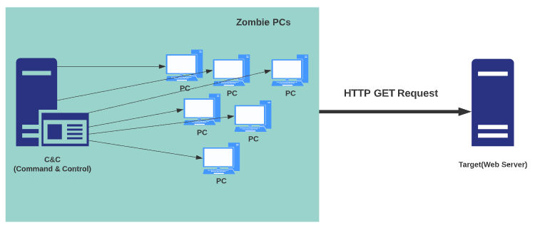

# 9 - 1 소프트웨어 개발 보안 설계

## 1. 소프트웨어 개발 보안 설계

### 1. SW 개발 보안의 개념

> 소스 코드 등에 존재하는 보안 취약점을 제거하고, 보안을 고려하여 기능을 설계 및 구연하는 등 소프트웨어 개발 과정에서 지켜야 할 일련의 보안 활동

SW 개발 보안 생명 주기 : 요구사항 명세 -> 설계 -> 구현 -> 테스트 -> 유지보수

---

### 2. SW 개발 보안의 구성요소

- **SW 개발 보안 3대 요소** (기 무 가)
  - **기밀성**(Confidentiality) : 시스템 내의 정보와 자원은 **인가된 사용자에게만 접근이 허용**, 정보가 전송 중에 노출되더라도 데이터를 **읽을 수 없음**
  - **무결성**(Integrity) : 시스템 내의 정보는 **오직 인가된 사용자만 수정할 수 있음** + **완전성, 일관성, 데이터 훼손 및 파손 X**
  - **가용성**(Availability) : 인가받은 사용자는 시스템 내의 정보와 자원을 **언제라도 사용**할 수 있음

- SW 개발 보안 용어
  - 자산(Assets) : 조직의 데이터 또는 조직의 소유자가 가치를 부여한 대상
    - ex) 서버의 하드웨어, 기업의 중요 데이터
  - 위협(Threat) : 조직이나 기업의 자산에 악영향을 끼칠 수 있는 사건이나 행위
    - ex) 해킹, 삭제, 자산의 불법적인 유출, 위/변조, 파손
  - 취약점(Vulnerability) : 위협이 발생하기 위한 사전 조건으로 시스템의 정보 보증을 낮추는 데 사용되는 약점
    - 평문 전송, 입력값 미검증, 비밀번호를 공유
  - 위험(Risk) : 위협이 취약점을 이용하여 조직의 자산 손실 피해를 가져올 가능성

---

### 3. SW 개발 보안을 위한 공격기법의 이해

#### 1. DoS 공격 (Denial of Service)

> 시스템을 **악의적으로 공격**해서 해당 시스템의 자원을 부족하게 하여 원래 의도된 용도로 사용하지 못하게 하는 공격
>
> 특정 서버에게 수많은 접속 시도를 만들어 다른 이용자가 정상적으로 서비스 이용을 하지 못하게 하거나, 서버의 TCP 연결을 소진시키는 등의 공격

##### DoS 공격의 종류

- SYN 플러딩(SYN Flooding) : 서버의 동시 가용 사용자수를 SYN 패킷만 보내 점유하여 다른 사용자가 서버를 사용 불가능하게 하는 공격
- 
- UDP 플러딩(UDP Flooding) : 대량의 UDP 패킷을 만들어 임의의 포트 번호로 전송하여 응답 메시지를 생성하게 하여 지속해서 자원을 고갈시키는 공격
- 스머프(Smurf) / 스머핑(Smurfing) : 출발지 주소를 대상의 IP로 설정하여 **네트워크 전체에게 ICMP Echo패킷을 직접 브로드캐스팅하여 마비**시키는 공격으로 **제3의 사이트를 이용해 공격**하는 공격 기법
- 죽음의 핑(PoD: Ping of Death) : ICMP 패킷을 **정상적인 크기보다 아주 크게 만들어** 전송하여 정상적인 서비스를 못하도록 하는 공격
- 랜드 어택(Land Attack) : **출발지 IP와 목적지 IP를 같은 패킷 주소로** 만들어 보내 시스템의 가용성을 침해하는 공격
- 티어 드롭(Tear Drop) : IP패킷의 재조합 과정에서 **잘못된 정보( Fragment Offset) 로 인해 수신 시스템이 문제를 발생**하도록 만드는 공격
- 봉크(Bonk) / 보잉크(Boink) : 프로토콜의 오류 제어를 이용한 공격 기법

#### 2. DDoS 공격 (Distributed Denial of Service)

> DoS의 또 다른 형태로 여러 대의 공격자를 **분산 배치하여 동시에** 동작하게 함으로써 특정 사이트를 공격하는 기법
>
> 해커들이 취약한 인터넷 시스템에 대한 엑세스가 이뤄지면, 침입한 시스템에 소프트웨어를 설치하고 이를 실행시켜 원격에서 공격을 개시한다.

##### DDoS 공격 구성요소

핸들러 / 에이전트 / 마스터 / 공격자 / 데몬 프로그램

##### DDoS 공격 도구

- Trinoo : 많은 소스로부터 통합된 UDP flood 서비스 거부 공격을 유발하는 데 사용되는 도구

- Tribe Flood Network : 많은 소스에서 하나 혹은 여러개의 목표 시스템에 대해 서비스 거부 공격을 수행할 수 있는 도구

- Stacheldraht : 분산 서비스 거부 에이전트 역할을 하는 Linux 및 Solaris 시스템용 멀웨어 도구

  

##### DDoS 공격의 대응 방안

차단 정책 업데이트 / 좀비PC IP 확보 / 보안 솔루션 활용 / 홈페이지 보안 관리 / 시스템 패치

##### DDoS 공격의 종류

- 대역폭 소진 공격 (3~4계층)
  - UDP/ICMP Traffic Flooding
    - UDP/ICMP Flooding
    - DNS Query Flooding
  - TCP Traffic Flooding
    - SYN Flooding
    - SYN+ACK Flooding
  - IP Flooding
    - LAND Attack
    - Teardrop
- 서비스 (어플리케이션) 마비 공격
  - HTTP Traffic Flooding
    - GET Flooding
    - GET with Cache-Control
  - HTTP Header/Option Spoofing
    - Slowris
    - Sloworis
    - Slow HTTP Read DoS
  - Other L7 Service Flooding

##### DoS 와 DDoS 의 차이

- DoS 는 직접 공격, DDoS 는 공격하도록 지시
- DoS 는 한 사람에 의해 공격을 감행, DDoS는 수많은 감염 호스트를 통해 공격을 감행

#### 3. DRDoS 공격 (Distributed Reflection DoS)

> 공격자는 출발지 IP를 공격대상 IP로 위조하여 다수의 반사 서버로 요청 정보를 전송, 공격 대상자는 반사 서버로부터 다량의 응답을 받아서 서비스 거부(DoS) 가 되는 공격

#### 4. 세션 하이재킹 (Session Hijacking)

> TCP의 세션 관리 취약점을 이용한 공격 기법, *케빈 미트닉* 이 사용
>
> 세선을 가로채어 정상적인 인증 절차를 무시하고 **불법적으로 시스템 접속**

#### 5. 애플리케이션 공격

- HTTP GET 플러딩 (Flooding) : 과도한 Get 메시지를 이용하여 웹 서버의 과부하를 유발시키는 공격
- 
- Slowloris (Slow HTTP Header DoS) : HTTP GET 메서드를 사용하여 헤더의 최종 끝을 알리는 개행 문자열을 전송하지 않고, 대상 웹 서버와 연결상태를 장시간 지속시키고 연결자원을 모두 소진시키는 서비스 거부 공격
- **RUDY** ( Slow HTTP POST DoS) : **요청 헤더의 Content-Length를 비상장으로 크게 설정**하여 메시지 바디 부분을 매우 소량으로 보내 계속 연결상태를 유지시키는 공격
- Slow HTTP Read DoS : 다수 HTTP 패킷을 지속적으로 전송하여 웹서버의 연결상태가 장시간 지속, 연결자원을 소진시키는 서비스 거부 공격
- Hulk DoS : 공격자가 웹 페이지 주소를 지속적으로 변경하면서 다량으로 GET요청을 발생시키는 서비스 거부 공격
- Hash DoS : 많은 수의 파라미터를 POST 방식으로 웹서버로 전달하여 다수의 해시 충돌을 발생시켜서 자원을 소모시키는 서비스 거부 공격

#### 6. 네트워크 공격

- **스니핑(Sniffing)** : 공격대상의 **데이터만 몰래 들여다보는 수동적** 공격 기법
- 네트워크 스캐너(Scanner), 스니퍼(Sniffer) : 네트워크 하드웨어 및 소프트웨어 구성의 취약점 파악을 위해 공격자가 취약점을 탐색하는 공격 도구
- 패스워드 크래킹 (Password Cracking)
  - 사전 크래킹 : ID와 PW가 될 가능성이 있는 단어를 파일로 만들어 파일의 단어를 대입하여 크랙하는 공격 기법
  - 무차별 크래킹 : 무작위로 패스워드 자리에 대입하여 패스워드를 알아내는 공격 기법
  - 패스워드 하이브리드 공격 : 사전 공격 + 무차별 공격
  - 레인보우 테이블 공격 : 크래킹 하고자 하는 해시 값을 테이블에서 검색해서 역으로 패스워드를 찾는 공격 기법
- **ID 스푸핑 (Spoofing)** : 침입자가 인증된 컴퓨팅 시스템인 것처럼 속여서 인증된 **호스트의 IP 주소로 위조**하여 타깃에 전송하는 공격 기법
- **ARP 스푸핑 :** 공격자가 특정 호스트의 MAC 주소를 자신의 MAC 주소로 위조한 ARP Reply를 만들어 희생자에게 지속적으로 전송
- ICMP Redirect 공격 : 스니핑 시스템을 네트워크에 존재하는 또다른 라우터라고 알림으로써 패킷의 흐름을 바꾸는 공격 기법
- 트로이 목마 : 악성 루틴이 숨어있는 프로그램, 실행하면 악성 코드를 실행

#### 7. 시스템 보안 위협

##### 버퍼 오버플로우(Buffer Overflow) 공격

- 메모리에 할당된 버퍼 크기를 초과하는 양의 데이터를 입력하여 프로세스의 흐름을 변경시켜서 악성 코드를 실행 시키는 공격 기법

##### 백도어(Backdoor)

- 허가받지 않고 시스템에 접속하는 권리, 정상적인 인증 절차를 우회하는 기법

##### 주요 시스템 보안 공격 기법

포맷 스트링 공격 / 레이스 컨디션 공격 / 키로거 공격 / 루트킷

#### 8. 보안 관련 용어

- 스피어 피싱(Spear Phishing) : 발송 메일의 본문 링크나 첨부된 파일을 클릭하도록 유도하여 사용자의 개인정보를 탈취하는 공격 기법
- **스미싱(Smishing)** : SMS(문자)를 이용하여 개인 비밀정보를 요구하거나 휴대폰 소액 결제를 유도하는 피싱 공격
- 큐싱(Qshing) : QR코드를 통해 악성 앱을 내려받도록 유도하여 금융 정보를 빼내는 피싱 공격
- 봇넷(Botnet) : 악성 프로그램이 감염되어 있는 컴퓨터들이 네트워크로 연결된 형태
- APT 공격 (Advanced Persistent Threat) : 다양한 수단을 통한 지속적이고 지능적인 맞춤형 공격 기법
- 공급망 공격 (Supply Chain Attack) : SW개발사의 네트워크에 침투하여 악의적 코드를 삽입, 서버 배포하여 사용자가 설치 또는 업데이트시에 자동적으로 감염되도록 하는 공격 기법
- 제로데이 공격(Zero Day Attack) : 보안 취약점이 발견되어 널리 공표되기 전에 해당 취약점을 악용하여 이루어지는 보안 공격 기법
- 웜(Worm) : 스스로 복제하여 네트워크 등의 연결을 통하여 전파하는 악성 소프트웨어 프로그램
- 악성 봇(Malicious Bot) : 해커의 명령에 의해 원격에서 제어 똔느 실행이 가능한 프로그램 또는 코드
- 사이버 킬체인(Cyber Kill Chain) : 공격형 방위시스템, APT공격방어 분석 모델
- 랜섬웨어(Ransomware): 시스템의 파일을 암호화하여 인질처럼 잡고 몸값을 요구하는 악성 소프트웨어
- 이블 트윈(Evil Twin) 공격 : 핫스팟에 연결한 무선 사용자들의 정보를 탈취하는 무선 네트워크 공격 기법

---

### 4. 서버 인증 및 접근 통제

> 스니핑 방지 (SSL 인증서 설치), 피싱 방지, 데이터 변조 방지, 기업 신뢰도 향상(기업 인증)

##### 인증 기술의 유형

- 지식기반 인증 : 사용자가 기억하고 있는 지식(ID/PW)
- 소지기반 인증 : 소지하고 있는 사용자 물품(공인인증서, OTP)
- 생체기반 인증: 고유한 사용자의 생체 정보(홍채, 얼굴, 지문)
- 특정기반 인증: 사용자의 특징을 활용(서명, 몸짓)

##### 접근 통제 기법

- 식별(Identification) : 자신이 누구라고 시스템에 밝히는 행위
- 인증(Authentication) : 주체의 신원을 검증하기 위한 활동
- 인가(Authorization) : 인증된 주체에게 접근을 허용하는 활동
- 책임추적성(Accountability) : 주체의 접근을 추적하고 행동을 기록하는 활동

##### 서버 접근 통제 유형

- **임의적 접근 통제**(DAC; Discretionary Access Control)
  - 신분에 근거하여 객체에 대한 접근을 제한하는 방법
- **강제적 접근 통제**(MAC; Mandatory Access Control)
  - 주체가 갖는 접근 허가 권한에 근거하여 객체에 대한 접근을 제한하는 방법
- 역할 기반 접근 통제(RBAC; Role Based Access Control)
  - 중앙 관리자가 조직 내 맡은 역할에 기초하여 자원에 대한 접근을 제한하는 방법

##### 접근 통제 보호 모델

- 벨-라파듈라 모델(BLP) : 미 국방부지원 보안 모델, 보안 요소 중 **기밀성을 강조**하며 강제적 정책에 의해 접근 통제하는 모델이다
  - No Read Up : 보안수준이 낮은 주체는 보안 수준이 높은 객체를 읽어서는 안 됨
  - No Write Down : 보안수준이 높은 주체는 보안 수준이 낮은 객체에 기록하면 안 됨
- 비바 모델 : 벨-라파듈라 모델의 단점을 보완한 **무결성을 보장**하는 최초의 모델
  - No Read Down : 높은 등급의 주체는 낮은 등급의 객체를 읽을 수 없음
  - No Write Up : 낮은 등급의 주체는 상위 등급의 객체를 수정할 수 없음

### 5. SW 개발 보안을 위한 암호화 알고리즘

#### 암호 알고리즘(Encryption Algorithm)

> 데이터의 무결성 및 기밀성 확보를 위해 정보를 쉽게 해독할 수 없는 형태로 변환하는 기법

- 양방향 방식 : 대칭 키 암호 방식, 비대칭 키 암호 방식 -  암호화된 암호문을 복호화 할 수 있는 알고리즘이다.
- 일방향 해시함수 방식: MDC(변경 감지 코드), MAC(메시지 인증 코드)

##### 대칭 키 암호 방식

> 암호화와 복호화에 같은 암호 키를 쓰는 알고리즘

- 블록 암호 방식 : 고정 길이의 블록을 암호화하여 반복하는 알고리즘(DES, AES, SEED)
  - **DES : 54bits의 키와 64bits의 블록**
  - **AES : DES를 대체하는 알고리즘** , 128bits
  - **SEED : KISA 구현, 고속 블록, 128Bits**
- 스트림 암호 방식 : 매우 긴 주기의 난수열을 발생시켜 평문과 더불어 암호문을 생석하는 방식(RC4)

##### 비대칭 키 암호 방식

> 개인 키를 나눠 가지지 않은 사용자들이 안전하게 통신하는 방식, 공개키는 누구나 알 수 있으나 개인 키는 키의 소유자만 알고 있어야 한다. (RSA, 디피-헬만)

- **RSA : 소인수 분해의 어려움을 이용하여 암호화**

##### 일방향 암호 방식(해시 암호 방식)

> 임의 길이의 정보를 입력받아, 고정된 길이의 암호문(해시값)을 출력하는 암호 방식
>
> 암호화 수행은 하지만 **절대로 복호화가 불가능**한 알고리즘

- MAC : 키를 사용하는 메시지 인증 코드로 메시지의 무결성과 송신자의 인증 보장
- MDC : 키를 사용하지 않는 변경 감지 코드로 메시지의 무결성 보장

##### 대칭 키 암호화 알고리즘

- **DES** : 1975년 IBM 개발, 대칭 키 기반
- **SEED** : 1999년 한국인터넷진흥원(KISA) 개발
- **AES** : 2001년 미국 표준기술 연구소(NIST) 개발
- ARIA : 2004년 국가정보원과 산학연구협회가 개발
- IDEA : DES 대체, 스위스 연방기술기관 개발
- LFSR : 선형함수로 계산되는 구조로 되어있는 스트링 암호화 알고리즘

##### 비대칭 키 암호화 알고리즘

- 디피 헬만 : 최초의 공개 키 알고리즘
- RSA : 1977년 MIT 개발
- ElGamal : 1984년 ElGamal 개발
- ECC : 1985년 RSA 대안으로 개발

##### 해시 암호화 알고리즘

- **MD5 : MD4 개선한 암호화 알고리즘, 파일의 무결성 검사에 사용 , 128Bits 해시 알고리즘**
- **SHA (Secure Hash Algorithm) : 미국 표준**
- SHA-1 : 1993년 NSA에 미국 정부 표준 지정 
- SHA-256/384/512 : 256비트의 해시값을 생성하는 해시함수
- HAS-160 : 국내 표준 서명 알고리즘
- HAVAL : 메시지를 1024bits 블록으로 나눔

##### 솔트(Salt)

- **일방향 해시 함수에서 다이제스트를 생성할 경우 추가되는 임의의 문자열**

---

### 6. 안전한 전송을 위한 데이터 암호화 전송

#### IPSec(Internet Protocol Security)

> 무결성과 인증을 보장하는 인증 헤더와, 기밀성을 보장하는 암호화를 이용한 IP 보안 프로토콜

#### SSL(Secure Socket Layer) / TLS (Transport Layer Security)

> 클라이언트와 서버간의 웹데이터 암호화(기밀성) ,상호 인증 및 전송 시 데이터 무결성을 보장하는 보안 프로토콜

#### S-HTTP (Secure Hypertext Transfer Protocol)

> 웹 상에서 네트워크 트래픽을 암호화 하는 방법

---

### 7. 자산에 대한 보안 항목식별

자산 / 사용자 / 소유자 / 관리자

소프트웨어 / 하드웨어 / 데이터 / 문서 / 시설 / 지원설비 / 인력

---

### 8. SW 개발 보안 적용 사례

BSIMM / Open SAMM / Seven TouchPoints / MS SDL / OWASP CLASP

#### 문제

DOS 공격이란 ?

1대의 공격자 컴퓨터에서 타깃 시스템에 악성 패킷을 보내는 방식으로 공격하고,
타깃 시스템 측에서 공격자의 주소를 확인하고 차단하면 
더 이상 공격을 하지 못하는 단점이 있다.

다음은 SW 개발 보안의 3대 요소에 대한 설명이다. 빈칸을  채우시오

(    ) : 권한을 가진 사용자나 애플리케이션이 원하는 서비스를 지속 사용할 수 있도록 보장하는 특성

(    ) : 정당한 방법을 따르지 않고선 데이터가 변경될 수 없으며, 데이터의 정확성 및 완전성과 고의, 악의로 변경되거나 훼손 또는 파괴되지 않음을 보장하는 특성

무결성2   가용성1 

암호화와 복호화에 같은 암호 키를 쓰는 알고리즘으로 유형에는 블록 암호화 알고리즘과 스트림 암호화 알고리즘이 있는 암호 방식은?

대칭 키 암호 방식
