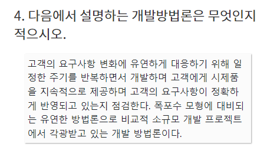
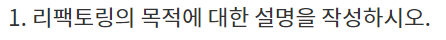
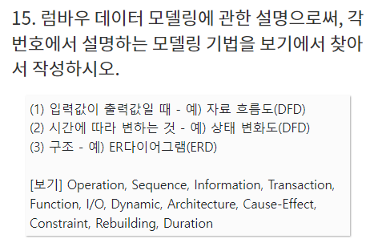
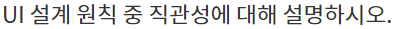

## 1-2단원 실기 문제풀이

### 1

### 

### 2

### 

### 3

### 4

### 소프트웨어 개발 방법론 종류

> 구조적 방법론, 정보공학 방법론, 객체 지향 방법론, 컴포넌트 기반 방법론, 애자일 방법론, 제품 계열 방법론

### 애자일(Agile)

- 절차보다는 사람이 중심이 되어 변화에 유연하고 신속하게 적응하면서 효율적으로 시스템을 개발할 수 있는 **신속, 적응적, 경량** 개발 방법

- 폭포수 모형에 대비되는 방법론

  - 폭포수 모델: 소프트웨어 개발 시 각 단계를 확실히 마무리 지은 후에 다음 단계로 넘어가는 모델. 선형, 순차적 모형

  - 개발과 함께 즉시 피드백 -> 유동적 개발 가능

#### 애자일 방법론의 유형

##### 1. XP(eXtreme Programing)

- 1~3주의 반복 개발 주기
- 5가지 가치
  - 용기(Courage): 용기를 가지고 자신감 있게 개발
  - 단순성(Simplicity): 필요한 것만 하고 그 이상의 것들은 하지 않음
  - 의사소통(Communication): 개발자, 관리자, 고객 간의 원활한 소통
  - 피드백(Feedback): 의사소통에 대한 빠른 피드백
  - 존중(Respect): 팀원 간 상호 존중
- 12가지 기본 원리
  - 짝 프로그래밍:우리했던거
  - 공동 코드 소유: 시스템에 있는 코드는 누구든지 언제라도 수정  ok
  - 지속적인 통합: 매일 여러 번 통합하고 빌드
  - 계획 세우기
  - 작은 릴리즈: 작은 시스템을 먼저 만들고 짧은 단위로 업데이트
  - 메타포어: 공통적인 이름 체계, 시스템 서술서
  - 간단한 디자인: 현재의 요구사항에 적합한 가장 단순한 시스템을 설계
  - 테스트 기반 개발: 프로그램에 대한 테스트를 먼저 수행하고 이걸 기반으로 코드 작성
  - 리팩토링: 프로그램의 기능을 바꾸지 않으면서 중복제거, 단순화 등을 위해 시스템을 재구성하는 원리
  - 40시간 작업: 피곤하니깐 일주일에 40시간 이상을 일하지 말아야 한다
  - 고객 상주: 개발자들의 질문에 즉각 답해줄 수 있는 고객을 풀타임 상주시켜야 함
  - 코드 표준: 모든 코드에 대한 코딩 표준을 정의해야 한다.

##### 2. 스크럼(SCRUM)

- 매일 정해진 시간, 장소에서 짧은 시간의 개발을 하는 팀을 위한 프로젝트 관리 중심 방법론
- 주요 개념
  - 백로그: 제품과 프로젝트에 대한 요구사항
  - 스프린트: 2~4주의 짧은 개발 기간으로 반복적 수행 - 개발품질 향상
  - 스크럼 미팅: 15분정도 짧게 모여서 Todo 짜는거
  - 스크럼 마스터: 프로젝트 리더
  - 스프린트 회고: 스프린트 주기 되돌아보며 규칙 잘 지켰는지, 개선점 확인
  - 번 다운 차트: 남아있는 백로그 대비 시간을 나타낸 차트

##### 3. 린(LEAN)

- 도요타의 린 시스템 품질기법을 개발에 적용
- 낭비 요소를 제거해서 품질 향상
- JIT(Just In Time), 칸반(Kanban)보드 사용

### 객체 지향 분석 방법론

> 사용자의 요구사항을 분석하여 요구된 문제와 관련된 모든 클래스(객체), 속성과 연산, 관계를 정의하여 모델링하는 기법

#### 객체 지향 분석 방법론 종류

##### 1. OOSE(Object Oriented Software Engineering)

- 야콥슨
- **유스케이스**에 의한 접근 방법 / 유스케이스가 모든 모델의 근간
- 분석, 설계, 구현 단계
- 기능적 요구사항 중심의 시스템

##### 2. OMT(Object Modeling Technology)

- 럼바우
- 그래픽 표기법을 이용하여 구성요소 모델링
- 객체 - 동적 - 기능 모델링 순서로 분석
  - 객체 모델링(Object Modeling) : 객체를 찾고 객체들간 관계를 정의하여 ERD 만드는 과정까지의 모델링. 객체 다이어그램을 활용하여 표현
  - 동적 모델링(Dynamic Modeling): 시간의 흐름에 따라 객체들 사이 제어흐름, 동작 순서같은 동적인 행위를 표현하는 모델링. 상태 다이어그램
  - 기능 모델링(Functional Modeling): 프로세스들의 자료 흐름을 중심으로 처리 과정 표현하는 모델링. 자료 흐름도(DFD)

##### 3. OOD(Object Oriented Design)

- 부치
- 설계 문서화 강조 - 다이어그램 중심으로 개발
- 분석과 설계 분리가 불가능

### UI 설계 원칙

> 직유 학유~
>
> **약술형 대비**

#### 1. 직관성 (Intuitiveness)

누구나 쉽게 이해하고, 쉽게 사용할 수 있어야 한다.

쉬운 검색, 쉬운 사용성, 일관성

#### 2. 유효성(Efficiency)

정확하고 완벽하게 사용자의 목표가 달성될 수 있도록 제작한다.

쉬운 오류 처리 및 복구

#### 3. 학습성(Learnability)

초보와 숙련자 모두가 쉽게 배우고 사용할 수 있게 제작

쉽게 학습, 쉽게 기억, 쉬운 접근

#### 4. 유연성(Flexibility)

사용자의 요구사항을 최대한 수용하고, 실수를 방지할 수 있도록 제작

오류 예방, 실수포용, 오류 감지
